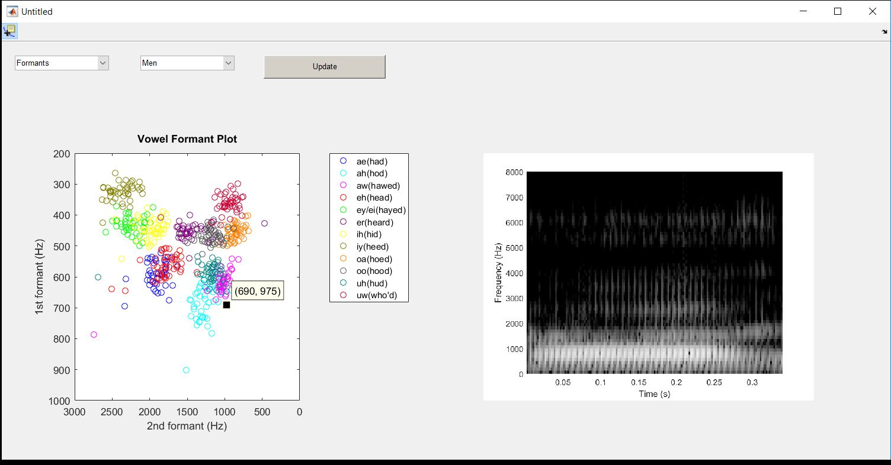
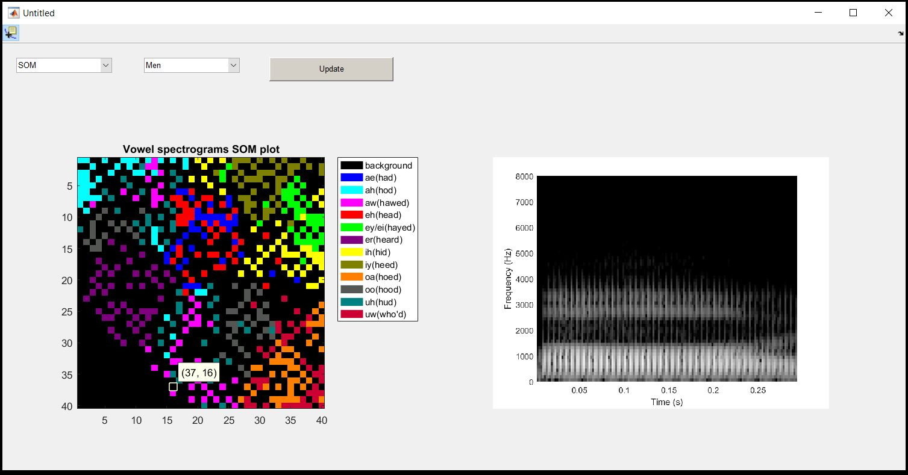

Speech Technology Project: Feature-specific vowel sounds clustering comparison
===================

### Authors
---
This repository is being developed as part of the course Speech Technology ([DT2112](https://www.kth.se/student/kurser/kurs/DT2112?l=en)) at [KTH Royal Institute of Technology](http://kth.se), in the Spring 17 P3 round.

| Author               | GitHub                                            |
|:---------------------|:--------------------------------------------------|
| Sergio López | [Serloapl](https://github.com/Serloapl) |
| Mónica Villanueva | [MonicaVillanueva](https://github.com/MonicaVillanueva)     |
| Diego Yus | [DYusL](https://github.com/DYusL)       |


### Description
---
This project aims to visualize the phonetical structure of English vowels using several features and techniques. 
The vowels are clusterized in a bi-dimensional space using two different methods: 
- The first method makes use of formants, the traditional approach in speech processing, where the values of the first two formants define the axes of the bi-dimensional space.
- The second method consists of a self organizing map (SOM), where the spectrograms of the vowels are used as inputs to create an alternative two dimensional representation of the vowel space.

To visualize both representations a simple UI has been created, which displays the resultant plots and allows to listen to the original audios and inspect their spectrograms, selecting them from the final low dimensional representations.

### Dataset
---
The dataset used in the project is an [English vowel sound database](https://homepages.wmich.edu/~hillenbr/voweldata.html) obtained from the Western
Michigan University. This database contains twelve different words to represent each vowel and is conformed by three datasets, one uttered by men, another by women and the final one by children.

### Instructions how to build and run
---
The solution is written in Matlab.
To open the UI, open `Matlab` and once in the `./gui` folder, type :
```matlab
>>gui1
```

### Images
---


